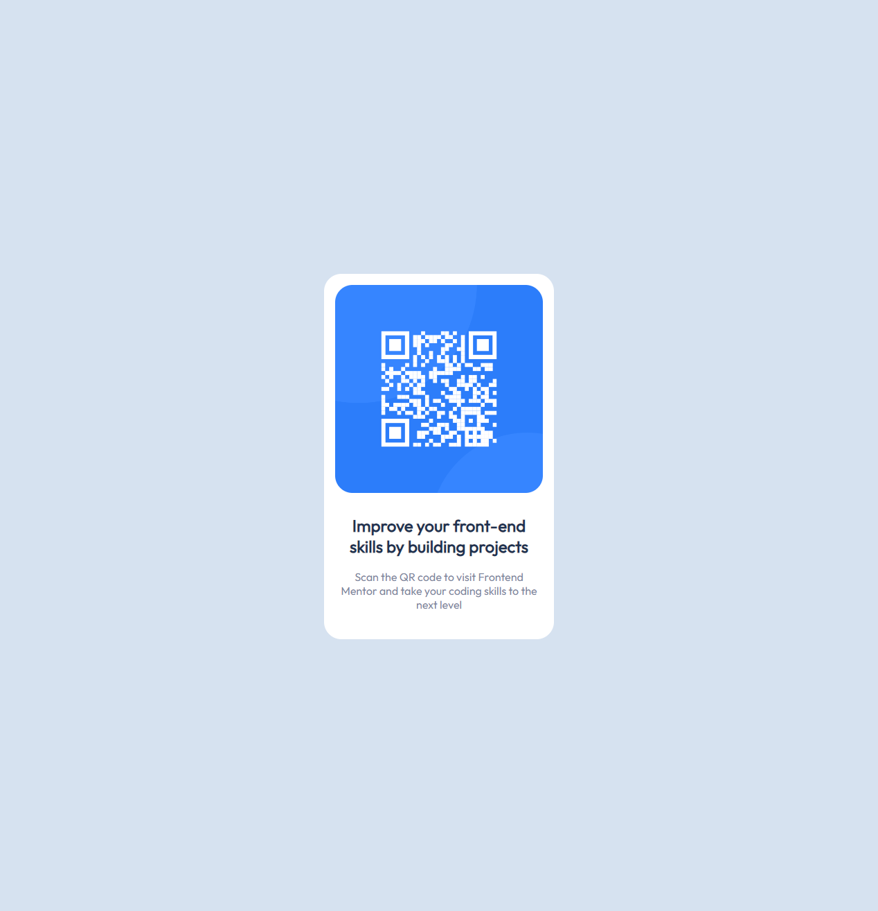

# Frontend Mentor - QR code component solution

This is a solution to the [QR code component challenge on Frontend Mentor](https://www.frontendmentor.io/challenges/qr-code-component-iux_sIO_H). Frontend Mentor challenges help you improve your coding skills by building realistic projects. 

## Table of contents

- [Overview](#overview)
  - [Screenshot](#screenshot)
  - [Links](#links)
- [My process](#my-process)
  - [Built with](#built-with)
    
## Overview

### Screenshot

### Links

- Solution URL: [github](https://github.com/StreamKing/frontendmaster-qr-code-challenge)
- Live Site URL: [github pages live site](https://streamking.github.io/frontendmaster-qr-code-challenge/)

## My process
First rough html scaffold then adding css classes for styling.

## Built with
- Semantic HTML5 markup
- Flexbox

